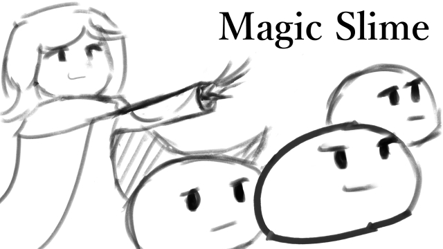
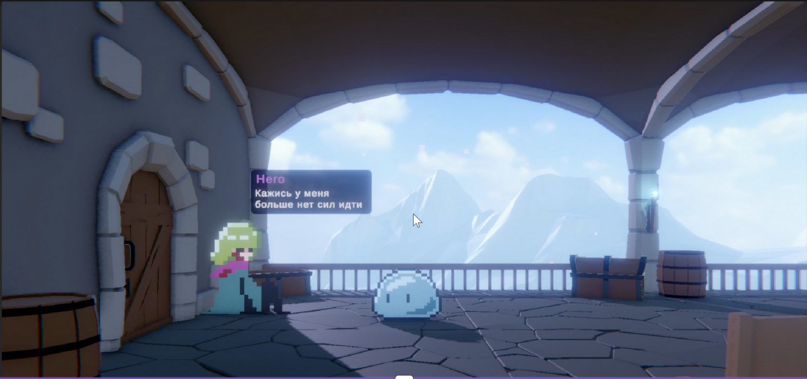

# 🧙‍♂️ Magic Slime  

---

## 🧩 Short Description  
**Magic Slime** is a Web3 action game where players control heroic slimes on a mission to reclaim the sacred crystal.  
The game solves the problem of **boring and overly complex blockchain games** - by combining fun, story-driven gameplay with seamless Solana integration.

---

## 🖼️ Screenshot / Cover  
### 🎨 Cover Art  

### 🕹️ In-Game Screenshot  

---

## 👤 Team  
**Team Name:** 64Bit  
**Developer:** Solo Developer - [Samurat Adilet]  
- [GitHub](https://github.com/adi2215)  
- [LinkedIn](https://www.linkedin.com/in/sam-pixel/)

---

## 🏆 Hackathon Participation  
**Event:** Game Jam Track - *“Create Your Game in Solana with iDos Games SDK”*  

---

## 🔗 Resources & Links  
- 🎥 **Pitch Video:** [Pitch Video Link](https://www.loom.com/share/48390fc111614acdb2cbed15d1c57452)  
- 🧠 **Technical Pitch:** [Technical Video Link](https://www.loom.com/share/0997ccc58fe34c67b3cb5eca46256b4c)  
- 📑 **Presentation Deck:** [Slide Deck Link](https://www.canva.com/design/DAG3R0UOkVI/6ejQDjPmNWxJRXbGyDeIBg/edit?utm_content=DAG3R0UOkVI&utm_campaign=designshare&utm_medium=link2&utm_source=sharebutton)  
- 📺 **YouTube Game Video:** [YouTube Link](https://youtu.be/JpAKSgWgLIc)
- 🌐 **Social Media:** [Threads](https://www.threads.com/@sampixelstudio?invite=0)
- **Colosseum:** [Colosseum Project](https://arena.colosseum.org/projects/explore/magic-slime)

---

## 💡 Problem & Solution  
Most blockchain games focus too much on tokens and not enough on gameplay.  
**Magic Slime** aims to fix that - by delivering a **fun, story-driven experience**. 
Players can buy, own, and combine unique slime heroes using **Solana** as the in-game currency.

---

## ⚙️ Key Features  
- Built with **Unity Engine**  
- Integrated **Solana** via **iDos Games SDK**  
- Smooth camera control with **Cinemachine**  
- Polished animations and transitions using **DoTween**  
- Various gameplay elements (NPCs, triggers, collectible items)  
- Assets **Aseprite and Unity Asset Store**  
- Developed **fully independently**

---

## 🧰 Tech Stack  
- **Language:** C#  
- **Engine:** Unity  
- **Blockchain SDK:** iDos Games SDK  
- **Libraries / Tools:** Cinemachine, DoTween, Input Manager, URP

---

## 🏗️ Project Architecture  
- **Player Controller:** Movement, jumping, item interactions  
- **Camera System:** Follows the player using Cinemachine  
- **NPC System:** Pathfinding and waypoint movement  
- **Trigger System:** Interactive areas and quest logic  
- **Blockchain Layer:** Handles wallet connection, Solana transactions, and NFT logic through iDos SDK  

---

## 🚀 Quick Start  
🎮 **Play Now:** [Idos Games](https://idosgames.com/en/app/?id=I5G9YDF8)  

To start playing:  
1. Register on the website  
2. Jump into the world of **Magic Slime**  

---

### 🪄 “Play as the Slimes. Save the World.”  
